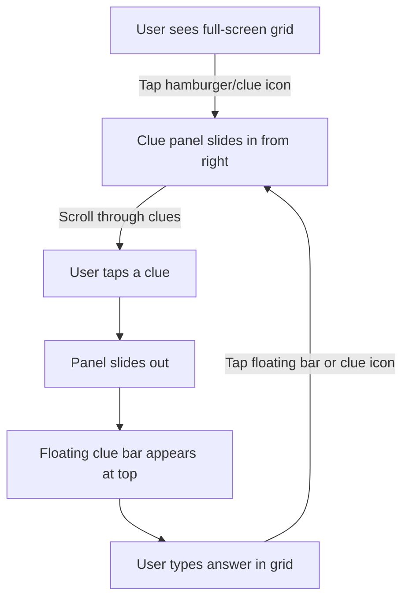

# Mobile Front-End Reimagination Plan

## Executive Summary

This document outlines a plan to redesign the cryptic crossword front-end with a **mobile-first UX paradigm**. The core innovation is a **slide-in clue panel** and **floating active clue overlay**, allowing users to always see their current clue while interacting with the grid.

---

## Current State Analysis

### Tech Stack

- **Framework**: React 19 + TypeScript + Vite
- **Styling**: 686 lines of custom CSS in `App.css`
- **State Management**: React hooks (useState, useEffect, useMemo)
- **Routing**: react-router-dom v7

### Current Mobile UX Pain Points

1. **Clues and grid can't coexist** — On mobile, the layout stacks with `flex-direction: column-reverse`, putting the clue list below the grid in a 30vh container
2. **No persistent clue visibility** — When focusing on the grid, users must scroll away to see the clue they're solving
3. **CSS is complex and brittle** — 686 lines of hand-written CSS with many responsive breakpoints

### Key Components

| Component                                                                                                               | Role                                                     |
| ----------------------------------------------------------------------------------------------------------------------- | -------------------------------------------------------- |
| [PlaySession.tsx](file:///home/william/src/tries/2026-01-06-cryptic-share/crossword-frontend/src/pages/PlaySession.tsx) | Main puzzle-solving page with grid/clue state management |
| [ClueList.tsx](file:///home/william/src/tries/2026-01-06-cryptic-share/crossword-frontend/src/ClueList.tsx)             | Renders across/down clues with selection highlighting    |
| [CrosswordGrid.tsx](file:///home/william/src/tries/2026-01-06-cryptic-share/crossword-frontend/src/CrosswordGrid.tsx)   | Renders the puzzle grid with cell interactions           |

---

## Proposed UX Design

### Mobile Interaction Flow



### UI States

```carousel
**State 1: Grid Focus Mode**
- Full-screen grid view
- Floating action button (FAB) or icon in corner to open clues
- If a clue is active: floating clue bar at top showing current clue text
<!-- slide -->
**State 2: Clue Selection Mode**
- Slide-in panel from right (or bottom sheet)
- Full list of Across/Down clues
- Tapping a clue dismisses panel and activates that clue
<!-- slide -->
**State 3: Active Clue Overlay**
- Compact bar pinned to top of screen
- Shows: "12 Across: *Clue text here (5)*"
- Tap to re-open clue panel
- Grid scrolls independently below
```

---

## Phase 1: Install a CSS Framework

### Recommendation: **Tailwind CSS v4**

> [!TIP]
> Tailwind CSS provides utility classes that work exceptionally well for mobile-first design, responsive breakpoints, and animation utilities — all of which we need for the slide-in panel UX.

**Why Tailwind?**

1. **Mobile-first responsive utilities** — `sm:`, `md:`, `lg:` prefixes make responsive design declarative
2. **Built-in transitions/transforms** — `translate-x-full`, `transition-transform` for slide-in panels
3. **Dark mode support** — Matches our existing `[data-theme="dark"]` patterns
4. **Widely tested** — Reduces CSS bugs compared to hand-written styles

**Alternative Considered**: Bootstrap — Heavier, less flexible for custom animations

### Installation Steps

```bash
cd crossword-frontend
npm install tailwindcss @tailwindcss/vite
```

Then configure `vite.config.ts` and `tailwind.config.js` for the project.

---

## Phase 2: Create Mobile Layout Components

### New Components to Create

| Component               | Purpose                                  |
| ----------------------- | ---------------------------------------- |
| `MobileCluePanel.tsx`   | Slide-in panel containing full clue list |
| `FloatingClueBar.tsx`   | Sticky top bar showing active clue       |
| `MobilePlaySession.tsx` | Mobile-specific layout orchestrator      |

### Component Hierarchy (Mobile)

```
MobilePlaySession
├── FloatingClueBar (sticky, shows active clue)
├── CrosswordGrid (full screen, scrollable)
├── MobileCluePanel (slides in/out)
└── FAB (floating action button to toggle panel)
```

---

## Phase 3: Implement Slide-In Panel

### Behavior

1. Panel starts off-screen (`translate-x-full`)
2. Triggering open: animate `translate-x-0` with `transition-transform duration-300`
3. Backdrop overlay appears with fade-in
4. Clicking backdrop or a clue closes panel

### CSS Classes (Tailwind)

```css
/* Panel closed */
.clue-panel {
  @apply fixed inset-y-0 right-0 w-80 bg-surface transform translate-x-full transition-transform duration-300;
}

/* Panel open */
.clue-panel.open {
  @apply translate-x-0;
}
```

---

## Phase 4: Implement Floating Clue Bar

### Behavior

1. Only visible when a clue is active
2. Sticky to top of viewport (`sticky top-0`)
3. Displays: direction indicator, clue number, clue text
4. Tappable to re-open clue panel

### Example Layout

```
┌──────────────────────────────────────┐
│ ↔️ 12A: "Cryptic hint text..." (5)   │
└──────────────────────────────────────┘
```

---

## Phase 5: Responsive Strategy

### Breakpoint Strategy

| Screen Size             | Layout                               |
| ----------------------- | ------------------------------------ |
| Mobile (<768px)         | Grid + Floating bar + Slide-in panel |
| Tablet/Desktop (≥768px) | Side-by-side layout (current)        |

We'll use Tailwind's `md:` prefix to conditionally render the appropriate layout.

---

## Phase 6: Migration Strategy

### Approach

1. **Keep existing CSS working** — Don't break desktop layout
2. **Add Tailwind incrementally** — New mobile components use Tailwind
3. **Gradually refactor** — Migrate existing styles to Tailwind over time

### Files to Modify

| File                                                                                                                    | Changes                                        |
| ----------------------------------------------------------------------------------------------------------------------- | ---------------------------------------------- |
| [package.json](file:///home/william/src/tries/2026-01-06-cryptic-share/crossword-frontend/package.json)                 | Add Tailwind dependencies                      |
| [vite.config.ts](file:///home/william/src/tries/2026-01-06-cryptic-share/crossword-frontend/vite.config.ts)             | Configure Tailwind plugin                      |
| `tailwind.config.js`                                                                                                    | [NEW] Tailwind configuration                   |
| `src/index.css`                                                                                                         | [NEW] Tailwind base imports                    |
| [PlaySession.tsx](file:///home/william/src/tries/2026-01-06-cryptic-share/crossword-frontend/src/pages/PlaySession.tsx) | Detect mobile, render appropriate layout       |
| `src/components/mobile/`                                                                                                | [NEW] Directory for mobile-specific components |

---

## Verification Plan

### Automated Tests

> [!NOTE]
> The project currently has no automated tests configured. We'll add browser-based verification.

### Manual Verification Steps

1. **Install Tailwind** — Run `npm run dev`, verify no CSS regressions on desktop
2. **Mobile simulation** — Use Chrome DevTools device mode (iPhone 12)
3. **Clue panel** — Verify slide-in/out animation is smooth (300ms)
4. **Floating bar** — Verify it stays visible while scrolling grid
5. **Clue selection** — Tap clue → panel closes → grid focuses correct cell
6. **Touch interaction** — Verify grid cells respond to touch

---

## Open Questions for Review

> [!IMPORTANT]
> Before proceeding, please confirm:
>
> 1. **CSS Framework**: Is Tailwind CSS v4 acceptable, or do you prefer another library (e.g., Bootstrap, CSS Modules)?
> 2. **Panel direction**: Should clues slide in from the **right** (like a drawer) or from the **bottom** (like a sheet)?
> 3. **Keyboard input on mobile**: Should we add a custom on-screen keyboard for letter entry, or rely on the device keyboard?
